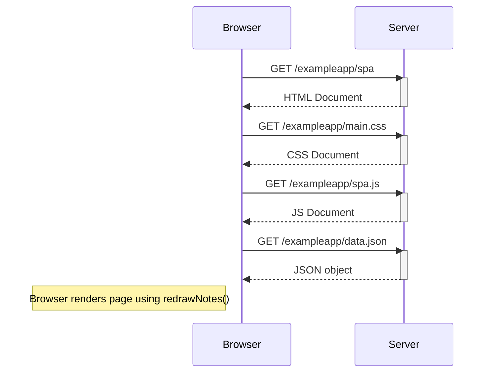

```mermaid
sequenceDiagram
  participant Browser
  participant Server

  Browser->>Server: GET /exampleapp/spa
  activate Server
  Server-->>Browser: HTML Document
  deactivate Server

  Browser->>Server: GET /exampleapp/main.css
  activate Server
  Server-->>Browser: CSS Document
  deactivate Server

  Browser->>Server: GET /exampleapp/spa.js
  activate Server
  Server-->>Browser: JS Document
  deactivate Server

  Browser->>Server: GET /exampleapp/data.json
  activate Server
  Server-->>Browser: JSON object
  deactivate Server

  Note left of Browser: Browser renders page using redrawNotes()
```
